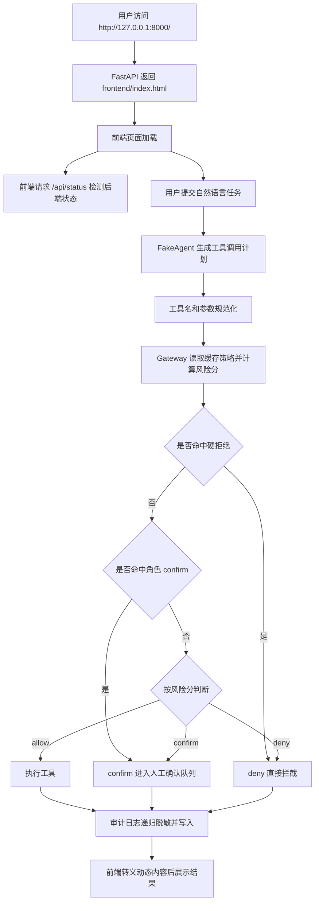

# Task7：项目可运行性、安全边界与展示体验优化

Task7 是在 Task3 已经完成“工具调用规范化、风险评分、人工确认、审计日志”的基础上，对当前项目进行进一步优化。

本次修改重点不是新增一个全新的业务模块，而是修复前面版本中影响演示、答辩和安全性的几个问题：

```text
1. README 中访问 / 只能看到 JSON，不能直接进入前端演示页面
2. CORS 配置过宽，存在不必要的跨站调用风险
3. 前端 API 地址硬编码，换端口或直接由后端托管时不够灵活
4. 角色策略 confirm 与最终风险分决策存在语义冲突
5. 审计日志只对 params 做有限脱敏，tool_result 和 original_input 仍可能泄露敏感信息
6. policy.yaml 每次风险判断会被重复读取，存在不必要的 I/O 开销
7. 缺少自动化测试，后续修改无法快速验证核心安全策略
8. 前端将接口返回内容直接拼接到 innerHTML，存在页面注入风险
```

---

## 一、Task7 目标

Task7 的目标是把当前原型从“能跑、能演示”继续优化为“更稳定、更安全、更容易答辩说明”的版本，主要完成：

```text
1. 后端根路径 / 直接返回前端页面
2. 新增 /api/status 作为后端状态接口
3. 收紧 CORS 配置
4. 前端 API 地址自动适配当前页面来源
5. 修正 confirm 策略语义，使角色策略和最终决策一致
6. 强化审计日志脱敏和长文本截断
7. 缓存 policy.yaml 读取结果
8. 新增网关策略单元测试
9. 修正 README 启动说明
10. 对前端动态内容做 HTML 转义
```

---

## 二、Task7 优化后的整体流程

Task7 后，系统访问和工具调用流程如下：



核心变化是：**页面展示入口、状态检测接口、网关决策语义、日志脱敏、前端渲染安全和测试验证都形成了闭环。**

---

## 三、修改文件总览

```text
Agent-Authorization/
│
├── backend/
│   ├── main.py              修改：前端入口、状态接口、CORS
│   ├── gateway.py           修改：confirm 决策语义、硬拒绝标记
│   ├── audit_logger.py      修改：递归脱敏、长文本截断
│   └── policy_loader.py     修改：策略文件缓存
│
├── frontend/
│   └── index.html           修改：API 地址自动适配、HTML 转义
│
├── tests/
│   └── test_gateway.py      新增：网关核心策略测试
│
├── README.md                修改：启动说明、状态接口、测试命令
└── Task7.md                 新增/重写：Task7 修改报告
```

---

# 四、具体修改说明与代码片段

## 1. `backend/main.py`

### 1.1 修改功能

原来访问：

```text
http://127.0.0.1:8000/
```

只能得到一个 JSON 状态信息。这样和 README 中“启动成功后访问根路径”的说明不一致，也不方便比赛展示。

Task7 修改后：

```text
/            返回 frontend/index.html
/api/status  返回后端状态 JSON
```

这样评委或使用者打开根路径就能直接看到演示页面，而不是接口 JSON。

### 1.2 新增代码片段

文件位置：

```text
backend/main.py
```

新增导入：

```python
from pathlib import Path

from fastapi.responses import FileResponse
```

新增前端文件路径：

```python
BASE_DIR = Path(__file__).resolve().parent.parent
FRONTEND_INDEX = BASE_DIR / "frontend" / "index.html"
```

新增根路径返回前端页面：

```python
@app.get("/")
def index():
    if FRONTEND_INDEX.exists():
        return FileResponse(FRONTEND_INDEX)

    return {
        "message": "Frontend file is missing",
        "expected_path": str(FRONTEND_INDEX)
    }
```

新增后端状态接口：

```python
@app.get("/api/status")
def api_status():
    return {
        "message": "AI Agent Auth Gateway is running",
        "version": "0.3.0",
        "task": "Task3 - 工具调用规范化与授权网关优化"
    }
```

### 1.3 删除/替换代码片段

原来的根路径直接返回 JSON：

```python
@app.get("/")
def index():
    return {
        "message": "AI Agent Auth Gateway is running",
        "version": "0.3.0",
        "task": "Task3 - 工具调用规范化与授权网关优化"
    }
```

现在这部分状态信息被移动到 `/api/status`，根路径专门用于展示前端页面。

### 1.4 CORS 配置优化

原配置：

```python
app.add_middleware(
    CORSMiddleware,
    allow_origins=["*"],
    allow_credentials=True,
    allow_methods=["*"],
    allow_headers=["*"],
)
```

问题：

```text
allow_origins=["*"] 表示允许任意来源访问
allow_credentials=True 表示允许携带凭据
二者组合在安全上不够严谨，也不适合后续扩展真实登录态
```

修改后：

```python
app.add_middleware(
    CORSMiddleware,
    allow_origins=[
        "http://127.0.0.1:8000",
        "http://localhost:8000",
        "http://127.0.0.1:5500",
        "http://localhost:5500",
    ],
    allow_credentials=False,
    allow_methods=["*"],
    allow_headers=["*"],
)
```

修改后的效果：

```text
1. 支持 FastAPI 自己托管前端页面
2. 支持 VS Code Live Server 5500 端口调试
3. 不再允许任意站点跨域调用
4. 不再允许跨站携带凭据
```

---

## 2. `frontend/index.html`

### 2.1 修改功能：前端 API 地址自动适配

原来前端写死了后端地址：

```javascript
const API_BASE = "http://127.0.0.1:8000";
```

问题：

```text
1. 如果后端临时换到 8001，页面仍会请求 8000
2. 如果页面由 FastAPI 托管，应该优先请求当前页面来源
3. 如果直接双击打开 HTML 文件，仍需要保留 127.0.0.1:8000 作为默认后端
```

修改后：

```javascript
const API_BASE = window.location.protocol === "file:"
    ? "http://127.0.0.1:8000"
    : window.location.origin;
document.getElementById("apiBaseText").textContent = API_BASE;
```

修改后的效果：

```text
1. http://127.0.0.1:8000/ 打开时，请求 http://127.0.0.1:8000
2. http://127.0.0.1:8001/ 打开时，请求 http://127.0.0.1:8001
3. file:// 方式打开时，仍默认请求 http://127.0.0.1:8000
```

### 2.2 修改功能：状态检测接口变更

原状态检测请求：

```javascript
const response = await fetch(`${API_BASE}/`);
```

问题：

```text
根路径 / 已经改为返回 HTML 页面，不再适合作为 JSON 状态检测接口。
```

修改后：

```javascript
const response = await fetch(`${API_BASE}/api/status`);
```

### 2.3 修改功能：前端动态内容 HTML 转义

原来前端多处直接把接口返回内容拼到 `innerHTML` 中，例如：

```javascript
${reasons.map(reason => `<li>${reason}</li>`).join("")}
```

问题：

```text
如果日志、文件内容、风险原因或用户输入中出现 <script> 等 HTML 片段，
浏览器可能把它当成页面代码解析，存在 XSS/页面注入风险。
```

Task7 新增统一转义函数：

```javascript
function escapeHtml(value) {
    return String(value ?? "")
        .replaceAll("&", "&amp;")
        .replaceAll("<", "&lt;")
        .replaceAll(">", "&gt;")
        .replaceAll('"', "&quot;")
        .replaceAll("'", "&#39;");
}
```

替换后的典型代码：

```javascript
${reasons.map(reason => `<li>${escapeHtml(reason)}</li>`).join("")}
```

请求参数展示也进行了转义：

```javascript
<pre>${escapeHtml(JSON.stringify(params, null, 2))}</pre>
```

审计日志展示也进行了转义：

```javascript
<p><strong>原始输入：</strong>${escapeHtml(log.original_input || "")}</p>
<p><strong>说明：</strong>${escapeHtml(log.message || "")}</p>
```

修改后的效果：

```text
1. 用户输入中的 HTML 标签会作为普通文本展示
2. 审计日志中的特殊字符不会被浏览器当成标签执行
3. 风险原因、pending 队列、攻击链演示结果展示更安全
```

---

## 3. `backend/gateway.py`

### 3.1 修改功能：修正 confirm 策略语义

原来的问题：

```text
config/policy.yaml 中 teacher 对 file.delete 配置为 confirm。
但是 gateway.py 会先给 file.delete 加基础风险分，再给 confirm 策略额外加 40 分。
最终风险分可能超过 deny 阈值，导致“配置为 confirm，实际变成 deny”。
```

这会导致策略语义不清楚：

```text
confirm 到底表示“需要人工确认”，还是只表示“风险分增加”？
```

Task7 的设计：

```text
1. policy_decision == deny：硬拒绝
2. 路径穿越、绝对路径：硬拒绝
3. policy_decision == confirm：固定进入人工确认
4. 普通情况：继续按风险分判断 allow / confirm / deny
```

### 3.2 新增代码片段

新增硬拒绝标记：

```python
risk_score = 0
reason = []
hard_deny = False
```

路径穿越命中硬拒绝：

```python
if ".." in path_lower:
    risk_score += 60
    hard_deny = True
    reason.append("路径中包含 ..，可能存在路径穿越风险")
```

绝对路径命中硬拒绝：

```python
if path_lower.startswith("/") or ":" in path_lower:
    risk_score += 40
    hard_deny = True
    reason.append("路径疑似绝对路径，存在越权访问风险")
```

新的最终决策逻辑：

```python
# 明确违规优先级最高：路径穿越、绝对路径、角色 deny 都必须拒绝。
if hard_deny or policy_decision == "deny":
    decision = "deny"

# confirm 策略表示该角色允许申请执行，但必须经过人工确认。
elif policy_decision == "confirm":
    decision = "confirm"
```

### 3.3 删除/替换代码片段

删除了 confirm 策略额外加风险分的逻辑：

```python
elif policy_decision == "confirm":
    risk_score += 40
    reason.append(policy_reason)
```

替换为：

```python
elif policy_decision == "confirm":
    reason.append(policy_reason)
```

原来的最终修正逻辑：

```python
if policy_decision == "deny":
    decision = "deny"

elif policy_decision == "confirm" and decision == "allow":
    decision = "confirm"
```

替换为：

```python
if hard_deny or policy_decision == "deny":
    decision = "deny"

elif policy_decision == "confirm":
    decision = "confirm"
```

修改后的效果：

```text
alice 作为 teacher 删除 public/notice.txt：
Task7 前：可能因为风险分过高变成 deny
Task7 后：稳定返回 confirm，进入人工确认队列

student 读取 secret/password.txt：
仍然 deny，因为命中 student deny 策略和敏感资源

alice 读取 ../../secret/password.txt：
仍然 deny，因为路径穿越属于 hard_deny
```

---

## 4. `backend/audit_logger.py`

### 4.1 修改功能：增强审计日志脱敏

原来的日志脱敏只处理 `params`，并且主要按参数 key 判断敏感字段。

原逻辑：

```python
def _mask_sensitive_value(key: str, value: Any):
    key_lower = key.lower()

    if any(word in key_lower for word in ["password", "token", "secret", "key", "credential"]):
        return "***MASKED***"

    if isinstance(value, dict):
        return {k: _mask_sensitive_value(k, v) for k, v in value.items()}

    return value
```

问题：

```text
1. original_input 中可能包含 password/token 等敏感词
2. tool_result 中可能包含读取文件结果
3. message 中可能包含用户拒绝原因或敏感描述
4. 过长文本写入日志会影响展示和存储
```

### 4.2 新增代码片段

新增敏感词列表和最大日志长度：

```python
SENSITIVE_WORDS = ["password", "token", "secret", "key", "credential", "密钥", "密码"]
MAX_LOG_VALUE_LENGTH = 500
```

增强后的递归脱敏函数：

```python
def _mask_sensitive_value(key: str, value: Any):
    """
    简单脱敏，避免日志里直接保存 password、token、key 等敏感值。
    """
    key_lower = str(key).lower()

    if any(word in key_lower for word in SENSITIVE_WORDS):
        return "***MASKED***"

    if isinstance(value, dict):
        return {k: _mask_sensitive_value(k, v) for k, v in value.items()}

    if isinstance(value, list):
        return [_mask_sensitive_value(key, item) for item in value]

    if isinstance(value, str):
        value_lower = value.lower()
        if any(word in value_lower for word in SENSITIVE_WORDS):
            return "***MASKED***"

        if len(value) > MAX_LOG_VALUE_LENGTH:
            return value[:MAX_LOG_VALUE_LENGTH] + "...[TRUNCATED]"

    return value
```

新增统一入口：

```python
def _mask_log_value(value: Any):
    return _mask_sensitive_value("", value)
```

写日志时统一处理：

```python
record = {
    "request_id": str(uuid4()),
    "time": _now(),
    "user": user,
    "original_input": _mask_log_value(original_input),
    "tool": tool,
    "params": _mask_log_value(params),
    "decision": gateway_result.get("decision"),
    "risk_score": gateway_result.get("risk_score"),
    "reason": gateway_result.get("reason"),
    "executed": executed,
    "pending_id": pending_id,
    "message": _mask_log_value(message),
    "tool_result": _mask_log_value(tool_result),
}
```

### 4.3 删除/替换代码片段

删除原来的 `_mask_params`：

```python
def _mask_params(params: Dict[str, Any]):
    if not isinstance(params, dict):
        return params

    return {k: _mask_sensitive_value(k, v) for k, v in params.items()}
```

替换原因：

```text
新的 _mask_log_value 不只处理 params，也能处理 original_input、message、tool_result；
同时支持 dict、list、str 的递归处理。
```

修改后的效果：

```text
1. 参数 key 为 password/token/secret/key 时会被脱敏
2. 字符串内容中包含 password/token/secret/key/密钥/密码 时会被脱敏
3. 工具执行结果也会被脱敏
4. 超过 500 字符的日志字段会被截断
```

---

## 5. `backend/policy_loader.py`

### 5.1 修改功能：缓存策略文件读取

原来的 `load_policy()` 每次调用都会打开并读取：

```text
config/policy.yaml
```

而一次 `check_tool_call()` 中会调用多个 helper：

```text
get_user_role
get_tool_risk
get_resource_risk
match_role_policy
get_decision_threshold
get_dangerous_keywords
```

这些 helper 都会间接读取策略文件，存在重复 I/O。

### 5.2 新增代码片段

新增导入：

```python
from functools import lru_cache
```

给 `load_policy()` 加缓存：

```python
@lru_cache(maxsize=1)
def load_policy() -> Dict[str, Any]:
    """
    读取 config/policy.yaml 策略配置文件。
    """
```

新增清理缓存函数：

```python
def clear_policy_cache():
    """
    清空策略缓存，便于测试或运行时手动重新加载配置。
    """
    load_policy.cache_clear()
```

修改后的效果：

```text
1. 同一进程内首次读取 policy.yaml 后会缓存结果
2. 后续网关判断不再重复打开 YAML 文件
3. 测试或运行时需要重新加载策略时，可调用 clear_policy_cache()
```

---

## 6. `README.md`

### 6.1 修改功能

修正虚拟环境激活路径，并补充根路径、状态接口和测试命令说明。

### 6.2 删除/替换代码片段

原激活命令：

```powershell
..\\venv\\Scripts\\Activate.ps1
```

修改后：

```powershell
.\\venv\\Scripts\\Activate.ps1
```

原因：

```text
README 说明是在项目根目录下运行，因此 venv 位于当前目录，应使用 .\venv。
```

### 6.3 新增说明片段

根路径说明：

```text
http://127.0.0.1:8000/

该地址会直接打开前端演示页面。
```

后端状态接口：

```text
http://127.0.0.1:8000/api/status
```

测试命令：

```powershell
python -m unittest discover -s tests
```

---

## 7. `tests/test_gateway.py`

### 7.1 新增功能

Task7 新增单元测试文件：

```text
tests/test_gateway.py
```

用于验证网关核心策略，避免后续修改破坏安全规则。

### 7.2 新增代码片段

完整测试代码：

```python
import unittest

from backend.gateway import check_tool_call
from backend.schemas import ToolCallRequest


class GatewayPolicyTest(unittest.TestCase):
    def _check(self, user, tool, params):
        request = ToolCallRequest(user=user, tool=tool, params=params)
        return check_tool_call(request)

    def test_public_file_read_is_allowed_for_student(self):
        result = self._check("student", "file.read", {"path": "public/notice.txt"})
        self.assertEqual(result["decision"], "allow")

    def test_secret_file_read_is_denied_for_student(self):
        result = self._check("student", "file.read", {"path": "secret/password.txt"})
        self.assertEqual(result["decision"], "deny")

    def test_teacher_file_delete_requires_confirmation(self):
        result = self._check("alice", "file.delete", {"path": "public/notice.txt"})
        self.assertEqual(result["decision"], "confirm")

    def test_path_traversal_is_hard_denied(self):
        result = self._check("alice", "file.read", {"path": "../../secret/password.txt"})
        self.assertEqual(result["decision"], "deny")

    def test_admin_high_risk_shell_call_requires_confirmation(self):
        result = self._check("admin", "shell.run", {"command": "dir"})
        self.assertEqual(result["decision"], "confirm")


if __name__ == "__main__":
    unittest.main()
```

### 7.3 覆盖场景

```text
1. student 读取 public/notice.txt：allow
2. student 读取 secret/password.txt：deny
3. alice 删除 public/notice.txt：confirm
4. alice 读取 ../../secret/password.txt：deny
5. admin 执行 shell.run：confirm
```

这些测试刚好覆盖 Task7 修改的核心逻辑：

```text
普通 allow
角色 deny
角色 confirm
路径穿越 hard_deny
高风险 allow 策略降级 confirm
```

---

# 五、Task7 后的关键业务流程

## 1. 页面访问流程

```text
用户访问 /
    ↓
FastAPI 检查 frontend/index.html 是否存在
    ↓
存在：返回 FileResponse，浏览器显示演示页面
    ↓
前端根据当前页面地址生成 API_BASE
    ↓
前端请求 /api/status
    ↓
显示后端运行状态
```

## 2. 网关决策流程

```text
工具调用请求
    ↓
规范化工具名和参数
    ↓
读取用户角色、工具风险、资源风险、角色策略
    ↓
检查路径穿越或绝对路径
    ↓
计算风险分
    ↓
按风险分得到初步 allow / confirm / deny
    ↓
按硬规则修正：
        hard_deny 或 policy deny → deny
        policy confirm → confirm
        policy allow + 高风险 deny → confirm
    ↓
返回最终决策
```

## 3. 审计日志流程

```text
网关产生结果
    ↓
准备审计记录
    ↓
对 original_input / params / message / tool_result 递归脱敏
    ↓
过长字符串截断
    ↓
写入 logs/audit.log
    ↓
前端读取日志
    ↓
前端 escapeHtml 后展示
```

---

# 六、验证结果

## 1. 依赖修复

当前虚拟环境最初缺少 `PyYAML`，导致无法导入 `backend.gateway`：

```text
ModuleNotFoundError: No module named 'yaml'
```

已执行：

```powershell
.\\venv\\Scripts\\python.exe -m pip install -r requirements.txt
```

补齐：

```text
PyYAML==6.0.3
```

## 2. 单元测试

执行命令：

```powershell
.\\venv\\Scripts\\python.exe -m unittest discover -s tests
```

结果：

```text
Ran 5 tests in 0.004s

OK
```

## 3. 语法检查

`compileall` 在当前 Windows 环境写入 `__pycache__` 时遇到权限问题：

```text
PermissionError: [WinError 5] 拒绝访问
```

因此改用不写 `.pyc` 的内存编译方式：

```powershell
.\\venv\\Scripts\\python.exe -B -c "from pathlib import Path; files=list(Path('backend').glob('*.py'))+list(Path('tests').glob('*.py')); [compile(path.read_text(encoding='utf-8'), str(path), 'exec') for path in files]; print(f'syntax ok: {len(files)} files')"
```

结果：

```text
syntax ok: 11 files
```

## 4. 后端接口验证

本机 `8000` 端口已有进程监听但请求超时，因此另在 `8001` 启动当前项目服务进行验证。

启动命令：

```powershell
.\\venv\\Scripts\\python.exe -m uvicorn backend.main:app --host 127.0.0.1 --port 8001
```

验证：

```text
http://127.0.0.1:8001/api/status 正常返回后端状态
http://127.0.0.1:8001/ 返回 text/html; charset=utf-8
```

---

# 七、Task7 完成后的项目亮点

```text
1. 演示入口更清晰
   打开根路径 / 就能直接进入前端页面，不再只看到 JSON。

2. 后端状态接口更规范
   /api/status 专门用于健康检查，前端状态检测更清楚。

3. CORS 更安全
   从任意来源开放改为仅允许本地演示来源。

4. 策略语义更一致
   confirm 不再被普通风险分意外升级成 deny，角色策略更容易解释。

5. 审计日志更安全
   original_input、params、message、tool_result 都会统一脱敏和截断。

6. 策略读取更高效
   policy.yaml 加缓存，减少重复文件读取。

7. 前端展示更安全
   动态内容 escapeHtml，降低页面注入风险。

8. 自动化测试补齐
   用 unittest 固化核心安全策略，后续改动可以快速回归。
```

---

# 八、Task7 总结

Task7 主要完成了项目的工程化和安全性补强。修改后，系统不只是能完成智能体工具调用授权流程，还进一步提升了：

```text
访问体验
配置安全
策略一致性
日志安全性
前端渲染安全
测试可验证性
```

最终系统流程更加完整：

```text
访问前端页面
↓
检测后端状态
↓
提交智能体任务
↓
网关风险评估
↓
allow / confirm / deny
↓
执行 / 人工确认 / 拦截
↓
审计日志脱敏记录
↓
前端安全展示
```

这一步的核心价值是：**让 Agent 授权网关从功能原型进一步变成更适合比赛展示、答辩说明和后续扩展的安全原型系统。**
