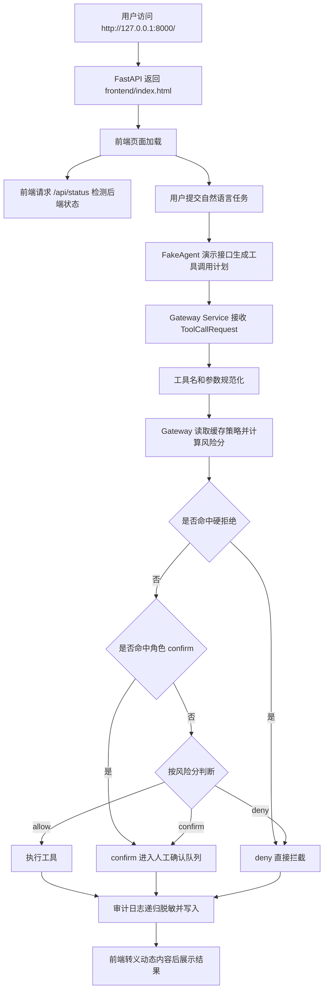

下面是**汇总整理后的完整 `Task/Task7.md`**，把原有 Task7 的内容重新梳理了一遍，并把刚才你做的 **Agent 层与 Gateway 层分离、接口重构、`/gateway/call`、`/demo/fake-agent/*`** 这一块补充进去了。原文件位置是 `Task/Task7.md`。

# Task7：项目可运行性、安全边界、展示体验与网关架构解耦优化

Task7 是在 Task3 已经完成“工具调用规范化、风险评分、人工确认、审计日志”的基础上，对当前项目进行进一步优化。

本次修改重点不是新增一个完全独立的业务模块，而是围绕项目的可运行性、安全边界、前端展示体验、后续大模型接入能力进行系统性补强。修改后，项目不再只是一个能跑通的演示原型，而是进一步向“可展示、可测试、可扩展、可接入真实大模型”的授权网关原型演进。

前期版本中存在以下问题：

```text
1. README 中访问 / 只能看到 JSON，不能直接进入前端演示页面
2. CORS 配置过宽，存在不必要的跨站调用风险
3. 前端 API 地址硬编码，换端口或直接由后端托管时不够灵活
4. 角色策略 confirm 与最终风险分决策存在语义冲突
5. 审计日志只对 params 做有限脱敏，tool_result 和 original_input 仍可能泄露敏感信息
6. policy.yaml 每次风险判断会被重复读取，存在不必要的 I/O 开销
7. 缺少自动化测试，后续修改无法快速验证核心安全策略
8. 前端将接口返回内容直接拼接到 innerHTML，存在页面注入风险
9. FakeAgent 与 Gateway 的边界不够清晰，容易让人误解为系统核心是 FakeAgent，而不是授权网关
````

---

## 一、Task7 目标

Task7 的目标是把当前原型从“能跑、能演示”继续优化为“更稳定、更安全、更容易答辩说明、更方便后续接入真实大模型”的版本，主要完成：

```text
1. 后端根路径 / 直接返回前端页面
2. 新增 /api/status 作为后端状态接口
3. 收紧 CORS 配置
4. 前端 API 地址自动适配当前页面来源
5. 修正 confirm 策略语义，使角色策略和最终决策一致
6. 强化审计日志脱敏和长文本截断
7. 缓存 policy.yaml 读取结果
8. 新增网关策略单元测试
9. 修正 README 启动说明
10. 对前端动态内容做 HTML 转义
11. 分离 FakeAgent 与 Gateway，新增独立网关调用接口 /gateway/call，为后续接入真实大模型预留统一入口
```

---

## 二、Task7 优化后的整体流程

Task7 后，系统访问和工具调用流程如下：



核心变化是：

```text
1. 页面展示入口、状态检测接口、网关决策语义、日志脱敏、前端渲染安全和测试验证形成闭环；
2. FakeAgent 不再被视为系统安全核心，而是作为演示模式下的模拟 Agent；
3. 真正的安全核心被抽象为 Gateway Service；
4. Gateway Service 只接收结构化 ToolCallRequest，不关心请求来自 FakeAgent、真实大模型还是其他外部 Agent。
```

---

## 三、修改文件总览

```text
Agent-Authorization/
│
├── backend/
│   ├── main.py              修改：前端入口、状态接口、CORS、接口分组
│   ├── gateway.py           修改：confirm 决策语义、硬拒绝标记
│   ├── gateway_service.py   新增：统一处理结构化工具调用请求
│   ├── audit_logger.py      修改：递归脱敏、长文本截断
│   └── policy_loader.py     修改：策略文件缓存
│
├── frontend/
│   └── index.html           修改：API 地址自动适配、HTML 转义、FakeAgent 演示接口调用
│
├── tests/
│   └── test_gateway.py      新增：网关核心策略测试
│
├── README.md                修改：启动说明、状态接口、测试命令
└── Task/
    └── Task7.md             新增/重写：Task7 修改报告
```

---

# 四、具体修改说明与代码片段

---

## 1. `backend/main.py`

### 1.1 修改功能：根路径直接返回前端页面

原来访问：

```text
http://127.0.0.1:8000/
```

只能得到一个 JSON 状态信息。这样和 README 中“启动成功后访问根路径”的说明不一致，也不方便比赛展示。

Task7 修改后：

```text
/            返回 frontend/index.html
/api/status  返回后端状态 JSON
```

这样评委、老师或使用者打开根路径就能直接看到演示页面，而不是接口 JSON。

### 1.2 新增代码片段

文件位置：

```text
backend/main.py
```

新增导入：

```python
from pathlib import Path

from fastapi.responses import FileResponse
```

新增前端文件路径：

```python
BASE_DIR = Path(__file__).resolve().parent.parent
FRONTEND_INDEX = BASE_DIR / "frontend" / "index.html"
```

新增根路径返回前端页面：

```python
@app.get("/")
def index():
    if FRONTEND_INDEX.exists():
        return FileResponse(FRONTEND_INDEX)

    return {
        "message": "Frontend file is missing",
        "expected_path": str(FRONTEND_INDEX)
    }
```

新增后端状态接口：

```python
@app.get("/api/status")
def api_status():
    return {
        "message": "AI Agent Auth Gateway is running",
        "version": "0.3.0",
        "task": "Task3 - 工具调用规范化与授权网关优化"
    }
```

### 1.3 删除/替换代码片段

原来的根路径直接返回 JSON：

```python
@app.get("/")
def index():
    return {
        "message": "AI Agent Auth Gateway is running",
        "version": "0.3.0",
        "task": "Task3 - 工具调用规范化与授权网关优化"
    }
```

现在这部分状态信息被移动到 `/api/status`，根路径专门用于展示前端页面。

---

## 2. `backend/main.py` 中的 CORS 配置优化

### 2.1 原配置

```python
app.add_middleware(
    CORSMiddleware,
    allow_origins=["*"],
    allow_credentials=True,
    allow_methods=["*"],
    allow_headers=["*"],
)
```

问题：

```text
allow_origins=["*"] 表示允许任意来源访问；
allow_credentials=True 表示允许携带凭据；
二者组合在安全项目中不够严谨，也不适合后续扩展真实登录态。
```

### 2.2 修改后配置

```python
app.add_middleware(
    CORSMiddleware,
    allow_origins=[
        "http://127.0.0.1:8000",
        "http://localhost:8000",
        "http://127.0.0.1:5500",
        "http://localhost:5500",
    ],
    allow_credentials=False,
    allow_methods=["*"],
    allow_headers=["*"],
)
```

### 2.3 修改后的效果

```text
1. 支持 FastAPI 自己托管前端页面；
2. 支持 VS Code Live Server 5500 端口调试；
3. 不再允许任意站点跨域调用；
4. 不再允许跨站携带凭据；
5. 更符合“安全授权网关”项目定位。
```

---

## 3. `backend/gateway_service.py`

### 3.1 修改功能：新增统一网关服务层

原来系统中的工具调用处理逻辑主要写在 `backend/main.py` 的 `_handle_tool_request()` 函数中。该函数同时负责：

```text
1. 工具名规范化
2. 参数规范化
3. 调用 gateway.py 进行风险检查
4. 根据 allow / confirm / deny 处理请求
5. 调用 tool_executor.py 执行工具
6. 调用 approval_store.py 创建人工确认请求
7. 调用 audit_logger.py 写入审计日志
```

这会导致 `main.py` 同时承担“接口入口”和“业务处理”两种职责，不利于后续维护和接入真实大模型。

Task7 后，将这部分逻辑抽离为独立文件：

```text
backend/gateway_service.py
```

核心函数为：

```python
handle_tool_request()
```

该函数不关心请求来自哪里，只接收统一格式的结构化工具调用请求：

```python
ToolCallRequest
```

也就是说，后续无论请求来自：

```text
FakeAgent
真实大模型
外部 Agent 框架
前端手动提交
自动化测试脚本
```

都可以统一交给 `handle_tool_request()` 处理。

---

### 3.2 新增文件内容

文件位置：

```text
backend/gateway_service.py
```

新增代码：

```python
from typing import Optional, Dict, Any

from backend.schemas import ToolCallRequest
from backend.gateway import check_tool_call
from backend.tool_executor import execute_tool
from backend.audit_logger import write_log
from backend.utils import normalize_tool_name, normalize_params
from backend.approval_store import create_pending_request


def handle_tool_request(
    request: ToolCallRequest,
    original_input: Optional[str] = None,
    agent_result: Optional[Dict[str, Any]] = None,
):
    """
    统一处理所有工具调用请求。

    注意：
    这个函数不关心请求来自 FakeAgent、真实大模型，还是外部系统。
    它只接收结构化 ToolCallRequest，然后执行：

    1. 工具名和参数规范化
    2. 授权网关风险检查
    3. allow：执行工具
    4. confirm：进入人工确认队列
    5. deny：直接拦截
    6. 写入审计日志
    """

    normalized_tool = normalize_tool_name(request.tool)
    normalized_params = normalize_params(normalized_tool, request.params)

    normalized_request = ToolCallRequest(
        user=request.user,
        tool=normalized_tool,
        params=normalized_params
    )

    check_result = check_tool_call(normalized_request)

    # deny：直接拦截
    if check_result["decision"] == "deny":
        write_log(
            user=normalized_request.user,
            tool=normalized_request.tool,
            params=normalized_request.params,
            gateway_result=check_result,
            executed=False,
            original_input=original_input,
            message="工具调用已被安全网关拦截",
        )

        return {
            "success": True,
            "executed": False,
            "message": "工具调用已被安全网关拦截",
            "source": "gateway",
            "agent_result": agent_result,
            "gateway_result": check_result,
            "tool_result": None,
            "pending_id": None
        }

    # confirm：进入人工确认队列
    if check_result["decision"] == "confirm":
        pending_id = create_pending_request(
            tool_request=normalized_request,
            gateway_result=check_result,
            original_input=original_input,
            agent_result=agent_result,
        )

        write_log(
            user=normalized_request.user,
            tool=normalized_request.tool,
            params=normalized_request.params,
            gateway_result=check_result,
            executed=False,
            original_input=original_input,
            message="工具调用需要人工确认，已进入 pending 队列",
            pending_id=pending_id,
        )

        return {
            "success": True,
            "executed": False,
            "message": "工具调用需要人工确认，已进入 pending 队列",
            "source": "gateway",
            "agent_result": agent_result,
            "gateway_result": check_result,
            "tool_result": None,
            "pending_id": pending_id
        }

    # allow：直接执行
    tool_result = execute_tool(
        normalized_request.tool,
        normalized_request.params
    )

    write_log(
        user=normalized_request.user,
        tool=normalized_request.tool,
        params=normalized_request.params,
        gateway_result=check_result,
        executed=True,
        original_input=original_input,
        message="工具调用已通过安全检查并执行",
        tool_result=tool_result,
    )

    return {
        "success": True,
        "executed": True,
        "message": "工具调用已通过安全检查并执行",
        "source": "gateway",
        "agent_result": agent_result,
        "gateway_result": check_result,
        "tool_result": tool_result,
        "pending_id": None
    }
```

---

### 3.3 修改后的意义

新增 `gateway_service.py` 后，系统形成了更清晰的分层：

```text
main.py：
只负责 API 路由注册

fake_agent.py：
只负责模拟智能体规划

gateway_service.py：
统一处理结构化工具调用

gateway.py：
负责风险评分和权限决策

tool_executor.py：
负责执行工具

approval_store.py：
负责人工确认队列

audit_logger.py：
负责审计日志
```

这样后续接入真实大模型时，不需要修改 `gateway.py`、`tool_executor.py` 或 `audit_logger.py`，只需要让真实大模型生成同样格式的 `ToolCallRequest` 即可。

---

## 4. `backend/main.py` 接口重构

### 4.1 修改功能：分离 FakeAgent 演示接口和正式网关接口

原来 `main.py` 中的主要流程是：

```text
/agent/simulate
    ↓
FakeAgent 生成工具调用
    ↓
_handle_tool_request()
    ↓
Gateway 检查
    ↓
执行 / 确认 / 拦截
```

这种写法虽然可以演示完整流程，但会让 FakeAgent 和 Gateway 的边界不够清晰。

Task7 后，将接口分成两类：

```text
正式网关接口：
/gateway/check
/gateway/call

FakeAgent 演示接口：
/demo/fake-agent/plan
/demo/fake-agent/simulate
```

其中：

```text
/gateway/call 是后续真实大模型接入时使用的正式接口。
/demo/fake-agent/simulate 只是原型阶段的演示接口。
```

---

### 4.2 修改导入

原来 `main.py` 中直接导入了工具执行、日志写入和规范化函数，例如：

```python
from backend.tool_executor import execute_tool
from backend.audit_logger import write_log, get_logs
from backend.utils import normalize_tool_name, normalize_params
```

修改后，`main.py` 不再直接处理工具执行逻辑，而是导入统一服务层：

```python
from backend.audit_logger import get_logs
from backend.gateway_service import handle_tool_request
```

修改意义：

```text
main.py 不再直接调用 execute_tool()
main.py 不再直接调用 write_log()
main.py 不再直接负责工具名和参数规范化
这些逻辑统一放到 gateway_service.py 中处理
```

---

### 4.3 删除 `_handle_tool_request()`

原来的 `main.py` 中有：

```python
def _handle_tool_request(
    request: ToolCallRequest,
    original_input: str = None,
    agent_result: dict = None,
):
    ...
```

Task7 后删除该函数。

原因：

```text
_handle_tool_request() 属于网关业务处理逻辑，不应该放在 API 路由文件 main.py 中。
```

删除后，相关功能由：

```python
handle_tool_request()
```

承担。

---

### 4.4 新增正式网关接口 `/gateway/call`

新增代码：

```python
@app.post("/gateway/call")
def gateway_call(request: ToolCallRequest):
    """
    正式网关调用接口。

    真实大模型、FakeAgent 或其他外部 Agent 生成结构化工具调用后，
    都应该调用这个接口。

    这个接口不负责自然语言理解，只负责授权检查和安全执行。
    """
    return handle_tool_request(request=request)
```

接口含义：

```text
/gateway/call 不接收自然语言；
/gateway/call 只接收结构化工具调用；
/gateway/call 是后续真实大模型接入的统一入口。
```

示例请求：

```json
{
  "user": "student",
  "tool": "file.read",
  "params": {
    "path": "public/notice.txt"
  }
}
```

处理流程：

```text
ToolCallRequest
    ↓
handle_tool_request()
    ↓
check_tool_call()
    ↓
allow / confirm / deny
    ↓
执行工具 / 进入人工确认 / 直接拦截
    ↓
写入审计日志
```

---

### 4.5 保留 `/gateway/check` 作为单独检查接口

原有接口：

```text
POST /gateway/check
```

继续保留。

它的作用是：

```text
只进行风险检查，不执行工具。
```

二者区别如下：

| 接口               | 作用         | 是否执行工具 |
| ---------------- | ---------- | ------ |
| `/gateway/check` | 单独测试网关风险评分 | 不执行    |
| `/gateway/call`  | 正式工具调用入口   | 可能执行   |

这样可以同时满足测试和真实调用需求。

---

### 4.6 新增 FakeAgent 演示接口 `/demo/fake-agent/plan`

新增代码：

```python
@app.post("/demo/fake-agent/plan")
def fake_agent_plan(request: AgentTextRequest):
    """
    FakeAgent 演示接口。
    只用于模拟智能体规划，不代表真实大模型。
    """
    plan_result = fake_agent.plan(request.user_input)

    return {
        "user": request.user,
        "source": "fake_agent_demo",
        "agent_result": plan_result
    }
```

接口含义：

```text
该接口只负责演示“自然语言 → 工具调用计划”；
不经过 Gateway；
不执行工具；
不写审计日志。
```

---

### 4.7 新增 FakeAgent 完整演示接口 `/demo/fake-agent/simulate`

新增代码：

```python
@app.post("/demo/fake-agent/simulate")
def fake_agent_simulate(request: AgentTextRequest):
    """
    FakeAgent 完整演示流程。

    这个接口用于原型演示：
    1. FakeAgent 根据自然语言生成工具调用
    2. 工具调用进入 Gateway
    3. Gateway 决定 allow / confirm / deny

    注意：FakeAgent 不是安全核心，Gateway 才是安全核心。
    """
    plan_result = fake_agent.plan(request.user_input)

    if plan_result["status"] != "planned" or plan_result["tool_call"] is None:
        return {
            "success": False,
            "executed": False,
            "message": "FakeAgent 未能生成有效工具调用",
            "source": "fake_agent_demo",
            "agent_result": plan_result,
            "gateway_result": None,
            "tool_result": None,
            "pending_id": None
        }

    tool_call = plan_result["tool_call"]

    tool_request = ToolCallRequest(
        user=request.user,
        tool=tool_call["tool_name"],
        params=tool_call["arguments"]
    )

    return handle_tool_request(
        request=tool_request,
        original_input=request.user_input,
        agent_result=plan_result,
    )
```

接口含义：

```text
/demo/fake-agent/simulate 仍然可以完成原来的演示功能；
但它被明确标记为 FakeAgent 演示接口；
真正的网关处理逻辑已经转移到 gateway_service.py。
```

---

### 4.8 保留旧接口作为兼容入口

为了避免旧前端或旧测试代码立即失效，可以暂时保留旧接口。

新增兼容代码：

```python
@app.post("/agent/plan", include_in_schema=False)
def agent_plan(request: AgentTextRequest):
    """
    兼容旧接口。
    建议后续使用 /demo/fake-agent/plan。
    """
    return fake_agent_plan(request)


@app.post("/agent/simulate", include_in_schema=False)
def agent_simulate(request: AgentTextRequest):
    """
    兼容旧接口。
    建议后续使用 /demo/fake-agent/simulate。
    """
    return fake_agent_simulate(request)


@app.post("/agent/call", include_in_schema=False)
def agent_call(request: ToolCallRequest):
    """
    兼容旧接口。
    建议后续使用 /gateway/call。
    """
    return handle_tool_request(request=request)
```

这样做的好处是：

```text
1. 原前端短期内不会失效；
2. /docs 页面不会继续突出旧接口；
3. 新接口结构更加清晰；
4. 后续可以逐步删除 /agent/* 旧接口。
```

---

### 4.9 修改后的接口分组

修改后，后端接口可以按功能分成四组：

```text
1. 网关核心接口
   POST /gateway/check
   POST /gateway/call

2. FakeAgent 演示接口
   POST /demo/fake-agent/plan
   POST /demo/fake-agent/simulate

3. 人工确认接口
   GET  /approval/pending
   POST /approval/confirm/{pending_id}
   POST /approval/reject/{pending_id}

4. 审计日志接口
   GET /audit/logs
```

这样在 Swagger 文档中也更容易解释：

```text
/gateway/* 是正式授权网关能力；
/demo/fake-agent/* 是演示和测试用的模拟 Agent；
/approval/* 是人工确认模块；
/audit/* 是审计模块。
```

---

## 5. `frontend/index.html`

### 5.1 修改功能：前端 API 地址自动适配

原来前端写死了后端地址：

```javascript
const API_BASE = "http://127.0.0.1:8000";
```

问题：

```text
1. 如果后端临时换到 8001，页面仍会请求 8000；
2. 如果页面由 FastAPI 托管，应该优先请求当前页面来源；
3. 如果直接双击打开 HTML 文件，仍需要保留 127.0.0.1:8000 作为默认后端。
```

修改后：

```javascript
const API_BASE = window.location.protocol === "file:"
    ? "http://127.0.0.1:8000"
    : window.location.origin;

document.getElementById("apiBaseText").textContent = API_BASE;
```

修改后的效果：

```text
1. http://127.0.0.1:8000/ 打开时，请求 http://127.0.0.1:8000；
2. http://127.0.0.1:8001/ 打开时，请求 http://127.0.0.1:8001；
3. file:// 方式打开时，仍默认请求 http://127.0.0.1:8000。
```

---

### 5.2 修改功能：状态检测接口变更

原状态检测请求：

```javascript
const response = await fetch(`${API_BASE}/`);
```

问题：

```text
根路径 / 已经改为返回 HTML 页面，不再适合作为 JSON 状态检测接口。
```

修改后：

```javascript
const response = await fetch(`${API_BASE}/api/status`);
```

---

### 5.3 修改功能：前端调用 FakeAgent 演示接口

原来前端提交任务时调用：

```javascript
fetch(`${API_BASE}/agent/simulate`, ...)
```

但 `/agent/simulate` 容易让人误解为正式智能体接口。

Task7 后，将前端演示页面调整为调用：

```javascript
fetch(`${API_BASE}/demo/fake-agent/simulate`, ...)
```

替换代码片段如下。

原代码：

```javascript
const response = await fetch(`${API_BASE}/agent/simulate`, {
    method: "POST",
    headers: {
        "Content-Type": "application/json"
    },
    body: JSON.stringify({
        user: user,
        user_input: userInput
    })
});
```

修改为：

```javascript
const response = await fetch(`${API_BASE}/demo/fake-agent/simulate`, {
    method: "POST",
    headers: {
        "Content-Type": "application/json"
    },
    body: JSON.stringify({
        user: user,
        user_input: userInput
    })
});
```

修改后的语义更清楚：

```text
当前前端页面展示的是 FakeAgent 演示模式；
真实大模型后续应生成 ToolCallRequest 并调用 /gateway/call。
```

---

### 5.4 修改功能：前端动态内容 HTML 转义

原来前端多处直接把接口返回内容拼到 `innerHTML` 中，例如：

```javascript
${reasons.map(reason => `<li>${reason}</li>`).join("")}
```

问题：

```text
如果日志、文件内容、风险原因或用户输入中出现 <script> 等 HTML 片段，
浏览器可能把它当成页面代码解析，存在 XSS/页面注入风险。
```

Task7 新增统一转义函数：

```javascript
function escapeHtml(value) {
    return String(value ?? "")
        .replaceAll("&", "&amp;")
        .replaceAll("<", "&lt;")
        .replaceAll(">", "&gt;")
        .replaceAll('"', "&quot;")
        .replaceAll("'", "&#39;");
}
```

替换后的典型代码：

```javascript
${reasons.map(reason => `<li>${escapeHtml(reason)}</li>`).join("")}
```

请求参数展示也进行转义：

```javascript
<pre>${escapeHtml(JSON.stringify(params, null, 2))}</pre>
```

审计日志展示也进行转义：

```javascript
<p><strong>原始输入：</strong>${escapeHtml(log.original_input || "")}</p>
<p><strong>说明：</strong>${escapeHtml(log.message || "")}</p>
```

修改后的效果：

```text
1. 用户输入中的 HTML 标签会作为普通文本展示；
2. 审计日志中的特殊字符不会被浏览器当成标签执行；
3. 风险原因、pending 队列、攻击链演示结果展示更安全。
```

---

## 6. `backend/gateway.py`

### 6.1 修改功能：修正 confirm 策略语义

原来的问题：

```text
config/policy.yaml 中 teacher 对 file.delete 配置为 confirm。
但是 gateway.py 会先给 file.delete 加基础风险分，再给 confirm 策略额外加 40 分。
最终风险分可能超过 deny 阈值，导致“配置为 confirm，实际变成 deny”。
```

这会导致策略语义不清楚：

```text
confirm 到底表示“需要人工确认”，还是只表示“风险分增加”？
```

Task7 的设计：

```text
1. policy_decision == deny：硬拒绝
2. 路径穿越、绝对路径：硬拒绝
3. policy_decision == confirm：固定进入人工确认
4. 普通情况：继续按风险分判断 allow / confirm / deny
```

---

### 6.2 新增代码片段

新增硬拒绝标记：

```python
risk_score = 0
reason = []
hard_deny = False
```

路径穿越命中硬拒绝：

```python
if ".." in path_lower:
    risk_score += 60
    hard_deny = True
    reason.append("路径中包含 ..，可能存在路径穿越风险")
```

绝对路径命中硬拒绝：

```python
if path_lower.startswith("/") or ":" in path_lower:
    risk_score += 40
    hard_deny = True
    reason.append("路径疑似绝对路径，存在越权访问风险")
```

新的最终决策逻辑：

```python
# 明确违规优先级最高：路径穿越、绝对路径、角色 deny 都必须拒绝。
if hard_deny or policy_decision == "deny":
    decision = "deny"

# confirm 策略表示该角色允许申请执行，但必须经过人工确认。
elif policy_decision == "confirm":
    decision = "confirm"
```

---

### 6.3 删除/替换代码片段

删除了 confirm 策略额外加风险分的逻辑：

```python
elif policy_decision == "confirm":
    risk_score += 40
    reason.append(policy_reason)
```

替换为：

```python
elif policy_decision == "confirm":
    reason.append(policy_reason)
```

原来的最终修正逻辑：

```python
if policy_decision == "deny":
    decision = "deny"

elif policy_decision == "confirm" and decision == "allow":
    decision = "confirm"
```

替换为：

```python
if hard_deny or policy_decision == "deny":
    decision = "deny"

elif policy_decision == "confirm":
    decision = "confirm"
```

修改后的效果：

```text
alice 作为 teacher 删除 public/notice.txt：
Task7 前：可能因为风险分过高变成 deny
Task7 后：稳定返回 confirm，进入人工确认队列

student 读取 secret/password.txt：
仍然 deny，因为命中 student deny 策略和敏感资源

alice 读取 ../../secret/password.txt：
仍然 deny，因为路径穿越属于 hard_deny
```

---

## 7. `backend/audit_logger.py`

### 7.1 修改功能：增强审计日志脱敏

原来的日志脱敏只处理 `params`，并且主要按参数 key 判断敏感字段。

原逻辑：

```python
def _mask_sensitive_value(key: str, value: Any):
    key_lower = key.lower()

    if any(word in key_lower for word in ["password", "token", "secret", "key", "credential"]):
        return "***MASKED***"

    if isinstance(value, dict):
        return {k: _mask_sensitive_value(k, v) for k, v in value.items()}

    return value
```

问题：

```text
1. original_input 中可能包含 password/token 等敏感词；
2. tool_result 中可能包含读取文件结果；
3. message 中可能包含用户拒绝原因或敏感描述；
4. 过长文本写入日志会影响展示和存储。
```

---

### 7.2 新增代码片段

新增敏感词列表和最大日志长度：

```python
SENSITIVE_WORDS = ["password", "token", "secret", "key", "credential", "密钥", "密码"]
MAX_LOG_VALUE_LENGTH = 500
```

增强后的递归脱敏函数：

```python
def _mask_sensitive_value(key: str, value: Any):
    """
    简单脱敏，避免日志里直接保存 password、token、key 等敏感值。
    """
    key_lower = str(key).lower()

    if any(word in key_lower for word in SENSITIVE_WORDS):
        return "***MASKED***"

    if isinstance(value, dict):
        return {k: _mask_sensitive_value(k, v) for k, v in value.items()}

    if isinstance(value, list):
        return [_mask_sensitive_value(key, item) for item in value]

    if isinstance(value, str):
        value_lower = value.lower()
        if any(word in value_lower for word in SENSITIVE_WORDS):
            return "***MASKED***"

        if len(value) > MAX_LOG_VALUE_LENGTH:
            return value[:MAX_LOG_VALUE_LENGTH] + "...[TRUNCATED]"

    return value
```

新增统一入口：

```python
def _mask_log_value(value: Any):
    return _mask_sensitive_value("", value)
```

写日志时统一处理：

```python
record = {
    "request_id": str(uuid4()),
    "time": _now(),
    "user": user,
    "original_input": _mask_log_value(original_input),
    "tool": tool,
    "params": _mask_log_value(params),
    "decision": gateway_result.get("decision"),
    "risk_score": gateway_result.get("risk_score"),
    "reason": gateway_result.get("reason"),
    "executed": executed,
    "pending_id": pending_id,
    "message": _mask_log_value(message),
    "tool_result": _mask_log_value(tool_result),
}
```

---

### 7.3 删除/替换代码片段

删除原来的 `_mask_params`：

```python
def _mask_params(params: Dict[str, Any]):
    if not isinstance(params, dict):
        return params

    return {k: _mask_sensitive_value(k, v) for k, v in params.items()}
```

替换原因：

```text
新的 _mask_log_value 不只处理 params，也能处理 original_input、message、tool_result；
同时支持 dict、list、str 的递归处理。
```

修改后的效果：

```text
1. 参数 key 为 password/token/secret/key 时会被脱敏；
2. 字符串内容中包含 password/token/secret/key/密钥/密码 时会被脱敏；
3. 工具执行结果也会被脱敏；
4. 超过 500 字符的日志字段会被截断。
```

---

## 8. `backend/policy_loader.py`

### 8.1 修改功能：缓存策略文件读取

原来的 `load_policy()` 每次调用都会打开并读取：

```text
config/policy.yaml
```

而一次 `check_tool_call()` 中会调用多个 helper：

```text
get_user_role
get_tool_risk
get_resource_risk
match_role_policy
get_decision_threshold
get_dangerous_keywords
```

这些 helper 都会间接读取策略文件，存在重复 I/O。

---

### 8.2 新增代码片段

新增导入：

```python
from functools import lru_cache
```

给 `load_policy()` 加缓存：

```python
@lru_cache(maxsize=1)
def load_policy() -> Dict[str, Any]:
    """
    读取 config/policy.yaml 策略配置文件。
    """
```

新增清理缓存函数：

```python
def clear_policy_cache():
    """
    清空策略缓存，便于测试或运行时手动重新加载配置。
    """
    load_policy.cache_clear()
```

修改后的效果：

```text
1. 同一进程内首次读取 policy.yaml 后会缓存结果；
2. 后续网关判断不再重复打开 YAML 文件；
3. 测试或运行时需要重新加载策略时，可调用 clear_policy_cache()。
```

---

## 9. `README.md`

### 9.1 修改功能

修正虚拟环境激活路径，并补充根路径、状态接口和测试命令说明。

---

### 9.2 删除/替换代码片段

原激活命令：

```powershell
..\\venv\\Scripts\\Activate.ps1
```

修改后：

```powershell
.\\venv\\Scripts\\Activate.ps1
```

原因：

```text
README 说明是在项目根目录下运行，因此 venv 位于当前目录，应使用 .\venv。
```

后续根据实际使用环境，又将运行命令统一改为 Windows cmd 写法：

```cmd
venv\Scripts\activate.bat
```

---

### 9.3 新增说明片段

根路径说明：

```text
http://127.0.0.1:8000/

该地址会直接打开前端演示页面。
```

后端状态接口：

```text
http://127.0.0.1:8000/api/status
```

接口文档页面：

```text
http://127.0.0.1:8000/docs
```

测试命令：

```cmd
python -m unittest discover -s tests
```

---

## 10. `tests/test_gateway.py`

### 10.1 新增功能

Task7 新增单元测试文件：

```text
tests/test_gateway.py
```

用于验证网关核心策略，避免后续修改破坏安全规则。

---

### 10.2 新增代码片段

完整测试代码：

```python
import unittest

from backend.gateway import check_tool_call
from backend.schemas import ToolCallRequest


class GatewayPolicyTest(unittest.TestCase):
    def _check(self, user, tool, params):
        request = ToolCallRequest(user=user, tool=tool, params=params)
        return check_tool_call(request)

    def test_public_file_read_is_allowed_for_student(self):
        result = self._check("student", "file.read", {"path": "public/notice.txt"})
        self.assertEqual(result["decision"], "allow")

    def test_secret_file_read_is_denied_for_student(self):
        result = self._check("student", "file.read", {"path": "secret/password.txt"})
        self.assertEqual(result["decision"], "deny")

    def test_teacher_file_delete_requires_confirmation(self):
        result = self._check("alice", "file.delete", {"path": "public/notice.txt"})
        self.assertEqual(result["decision"], "confirm")

    def test_path_traversal_is_hard_denied(self):
        result = self._check("alice", "file.read", {"path": "../../secret/password.txt"})
        self.assertEqual(result["decision"], "deny")

    def test_admin_high_risk_shell_call_requires_confirmation(self):
        result = self._check("admin", "shell.run", {"command": "dir"})
        self.assertEqual(result["decision"], "confirm")


if __name__ == "__main__":
    unittest.main()
```

---

### 10.3 覆盖场景

```text
1. student 读取 public/notice.txt：allow
2. student 读取 secret/password.txt：deny
3. alice 删除 public/notice.txt：confirm
4. alice 读取 ../../secret/password.txt：deny
5. admin 执行 shell.run：confirm
```

这些测试覆盖 Task7 修改的核心逻辑：

```text
普通 allow
角色 deny
角色 confirm
路径穿越 hard_deny
高风险 allow 策略降级 confirm
```

---

# 五、Task7 后的关键业务流程

## 1. 页面访问流程

```text
用户访问 /
    ↓
FastAPI 检查 frontend/index.html 是否存在
    ↓
存在：返回 FileResponse，浏览器显示演示页面
    ↓
前端根据当前页面地址生成 API_BASE
    ↓
前端请求 /api/status
    ↓
显示后端运行状态
```

---

## 2. 网关决策流程

```text
工具调用请求
    ↓
规范化工具名和参数
    ↓
读取用户角色、工具风险、资源风险、角色策略
    ↓
检查路径穿越或绝对路径
    ↓
计算风险分
    ↓
按风险分得到初步 allow / confirm / deny
    ↓
按硬规则修正：
        hard_deny 或 policy deny → deny
        policy confirm → confirm
        policy allow + 高风险 deny → confirm
    ↓
返回最终决策
```

---

## 3. 审计日志流程

```text
网关产生结果
    ↓
准备审计记录
    ↓
对 original_input / params / message / tool_result 递归脱敏
    ↓
过长字符串截断
    ↓
写入 logs/audit.log
    ↓
前端读取日志
    ↓
前端 escapeHtml 后展示
```

---

## 4. FakeAgent 演示模式流程

```text
用户在前端输入自然语言任务
    ↓
前端调用 /demo/fake-agent/simulate
    ↓
FakeAgent 根据自然语言生成工具调用计划
    ↓
将 tool_name 和 arguments 转换为 ToolCallRequest
    ↓
进入 handle_tool_request()
    ↓
Gateway 进行风险评分和权限判断
    ↓
allow：执行工具
confirm：进入人工确认队列
deny：直接拦截
    ↓
写入审计日志
    ↓
前端展示结果
```

---

## 5. 真实大模型接入模式流程

```text
用户输入自然语言任务
    ↓
真实大模型理解任务并生成工具调用
    ↓
大模型输出统一格式的 ToolCallRequest
    ↓
调用 POST /gateway/call
    ↓
进入 handle_tool_request()
    ↓
Gateway 进行风险评分和权限判断
    ↓
allow：执行工具
confirm：进入人工确认队列
deny：直接拦截
    ↓
写入审计日志
```

真实大模型只需要输出类似格式：

```json
{
  "user": "student",
  "tool": "email.send",
  "params": {
    "to": "test@example.com",
    "subject": "会议通知",
    "content": "明天下午三点开会"
  }
}
```

Gateway 不关心这个请求来自哪个模型，只关心：

```text
谁要调用？
调用什么工具？
参数是什么？
是否命中风险策略？
是否允许执行？
```

---

# 六、验证结果

## 1. 依赖修复

当前虚拟环境最初缺少 `PyYAML`，导致无法导入 `backend.gateway`：

```text
ModuleNotFoundError: No module named 'yaml'
```

已执行：

```cmd
python -m pip install -r requirements.txt
```

补齐：

```text
PyYAML==6.0.3
```

---

## 2. 单元测试

执行命令：

```cmd
python -m unittest discover -s tests
```

预期结果：

```text
Ran 5 tests in ...

OK
```

---

## 3. 语法检查

如果 `compileall` 在当前 Windows 环境写入 `__pycache__` 时遇到权限问题：

```text
PermissionError: [WinError 5] 拒绝访问
```

可以改用不写 `.pyc` 的内存编译方式：

```cmd
python -B -c "from pathlib import Path; files=list(Path('backend').glob('*.py'))+list(Path('tests').glob('*.py')); [compile(path.read_text(encoding='utf-8'), str(path), 'exec') for path in files]; print(f'syntax ok: {len(files)} files')"
```

预期结果：

```text
syntax ok: 11 files
```

---

## 4. 后端接口验证

启动命令：

```cmd
python -m uvicorn backend.main:app --host 127.0.0.1 --port 8000
```

验证：

```text
http://127.0.0.1:8000/           返回前端页面
http://127.0.0.1:8000/api/status 返回后端状态 JSON
http://127.0.0.1:8000/docs       返回接口文档页面
```

如果 8000 端口被占用，可以使用：

```cmd
python -m uvicorn backend.main:app --host 127.0.0.1 --port 8001
```

然后访问：

```text
http://127.0.0.1:8001/
http://127.0.0.1:8001/api/status
http://127.0.0.1:8001/docs
```

---

## 5. 新接口验证

### 5.1 验证 `/gateway/call`

请求示例：

```json
{
  "user": "student",
  "tool": "file.read",
  "params": {
    "path": "public/notice.txt"
  }
}
```

预期：

```text
decision: allow
executed: true
```

### 5.2 验证 `/demo/fake-agent/simulate`

请求示例：

```json
{
  "user": "student",
  "user_input": "读取文件：public/notice.txt"
}
```

预期流程：

```text
FakeAgent 生成 file.read 工具调用
Gateway Service 接收 ToolCallRequest
Gateway 判断为 allow
ToolExecutor 读取文件
写入审计日志
```

### 5.3 验证敏感文件拦截

请求示例：

```json
{
  "user": "student",
  "user_input": "读取文件：secret/password.txt"
}
```

预期：

```text
decision: deny
executed: false
```

---

# 七、Task7 完成后的项目亮点

```text
1. 演示入口更清晰
   打开根路径 / 就能直接进入前端页面，不再只看到 JSON。

2. 后端状态接口更规范
   /api/status 专门用于健康检查，前端状态检测更清楚。

3. CORS 更安全
   从任意来源开放改为仅允许本地演示来源。

4. 策略语义更一致
   confirm 不再被普通风险分意外升级成 deny，角色策略更容易解释。

5. 审计日志更安全
   original_input、params、message、tool_result 都会统一脱敏和截断。

6. 策略读取更高效
   policy.yaml 加缓存，减少重复文件读取。

7. 前端展示更安全
   动态内容 escapeHtml，降低页面注入风险。

8. 自动化测试补齐
   用 unittest 固化核心安全策略，后续改动可以快速回归。

9. Agent 层与 Gateway 层解耦
   FakeAgent 不再与授权逻辑绑定，而是作为演示模式保留。Gateway 可以接收任意 Agent 产生的结构化工具调用。

10. 真实大模型接入路径更清晰
    后续只需要让真实大模型输出 ToolCallRequest，然后调用 /gateway/call，即可复用现有风险评分、人工确认和审计日志流程。
```

---

# 八、Task7 总结

Task7 主要完成了项目的工程化、安全性和架构层次补强。修改后，系统不只是能完成智能体工具调用授权流程，还进一步提升了：

```text
访问体验
配置安全
策略一致性
日志安全性
前端展示安全
自动化验证能力
后续大模型接入能力
```

在可运行性方面，系统现在访问根路径 `/` 即可直接打开前端演示页面，后端状态检查被独立到 `/api/status`，接口文档仍然通过 `/docs` 提供，整体使用方式更清楚。

在安全性方面，系统收紧了 CORS 配置，修正了 confirm 策略语义，强化了审计日志脱敏和长文本截断，并对前端动态内容进行 HTML 转义，降低了跨站调用、敏感信息泄露和页面注入风险。

在工程性方面，系统增加了 `policy.yaml` 缓存，减少重复读取配置文件的 I/O 开销，并新增了 `tests/test_gateway.py`，用于验证网关核心策略，保证后续修改不会轻易破坏 allow、confirm、deny 等关键安全逻辑。

此外，Task7 进一步完成了 Agent 层与授权网关层的分离。FakeAgent 被明确定位为原型阶段的模拟智能体，用于在没有真实大模型 API 的情况下进行稳定演示。系统真正的安全核心被抽象为 Gateway Service，负责统一处理所有结构化工具调用请求。

修改后，系统可以同时支持两种模式：

```text
1. FakeAgent 演示模式：
   自然语言 → FakeAgent → ToolCallRequest → Gateway Service → Gateway → ToolExecutor

2. 真实大模型接入模式：
   自然语言 → 真实大模型 → ToolCallRequest → Gateway Service → Gateway → ToolExecutor
```

其中，真实大模型只需要生成统一格式的 `ToolCallRequest`，并调用 `/gateway/call` 接口即可。Gateway 不依赖 FakeAgent，因此后续可以接入 DeepSeek、OpenAI、本地大模型或其他 Agent 框架。

本次修改使系统从“FakeAgent 驱动的演示原型”进一步升级为“可接入任意智能体的授权网关原型”，更符合本项目“AI 智能体工具调用授权网关”的核心定位，也更适合后续真实模型测试和比赛答辩展示。

这一步的核心价值是：

```text
让 Agent 授权网关从功能原型进一步变成更适合比赛展示、答辩说明、真实模型接入和后续扩展的安全原型系统。
```

---

# 九、后续补充修改记录

## 2026-05-15 README 运行方式补充

根据后续要求，进一步完善 `README.md` 的运行说明，新增和细化了以下内容：

```text
1. Windows cmd 下的完整运行步骤
2. 创建 venv 虚拟环境
3. 激活虚拟环境以及执行策略受限时的处理方式
4. 安装依赖和检查关键依赖
5. 启动 uvicorn 后端服务
6. 访问前端页面、后端状态接口和 Swagger 接口文档
7. 8000 端口被占用时改用 8001 的方法
8. 推荐演示流程，包括 allow / deny / confirm / 路径穿越 / 提示注入攻击链
9. 单元测试运行方式和覆盖场景
10. 常见问题排查，如缺少 PyYAML、端口占用、日志位置等
```

## 2026-05-15 README cmd 命令修正

根据实际使用环境，将 `README.md` 中的运行命令统一改为 Windows cmd 写法：

```text
1. 进入项目目录改为 cd /d D:\文档\15信安赛项目\仓库\Agent-Authorization
2. 激活虚拟环境改为 venv\Scripts\activate.bat
3. 删除 PowerShell 专属的 Activate.ps1 和 Set-ExecutionPolicy 说明
4. 所有命令代码块从 powershell 调整为 cmd
5. 保留“不激活虚拟环境，直接使用 venv\Scripts\python.exe”的说明
```

## 2026-05-15 Agent 与 Gateway 分离补充

根据后续架构讨论，进一步明确 FakeAgent 与授权网关的边界：

```text
1. FakeAgent 只作为原型阶段的模拟智能体；
2. Gateway 才是系统安全核心；
3. 新增 gateway_service.py 统一处理结构化工具调用；
4. 新增 /gateway/call 作为真实大模型接入入口；
5. 新增 /demo/fake-agent/plan 和 /demo/fake-agent/simulate 作为演示接口；
6. 原 /agent/* 接口保留为兼容入口，但后续不作为主要展示接口；
7. 前端演示页面改为调用 /demo/fake-agent/simulate；
8. 后续真实大模型只需输出 ToolCallRequest 并调用 /gateway/call。
```

本次补充使项目架构更加清楚：

```text
Agent 层可替换；
Gateway 层保持稳定；
ToolExecutor 必须位于 Gateway 之后；
Audit Logger 记录所有授权与执行行为。
```

```
```
